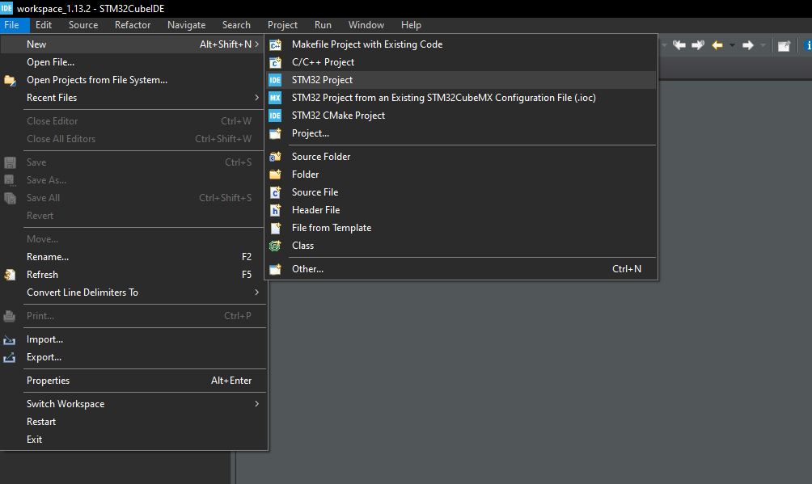
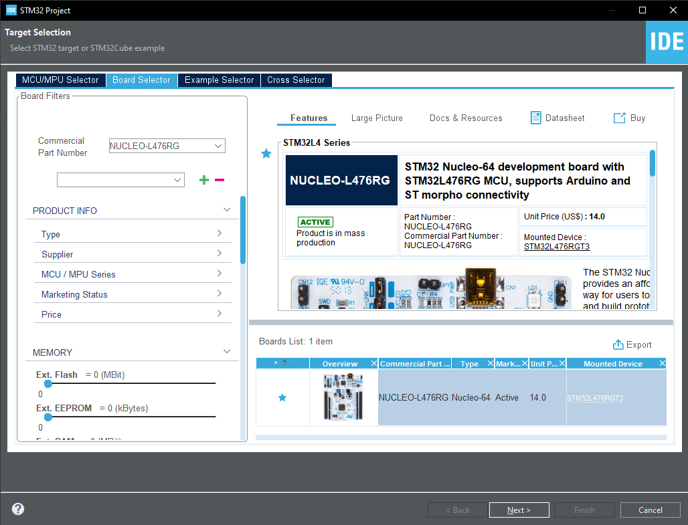
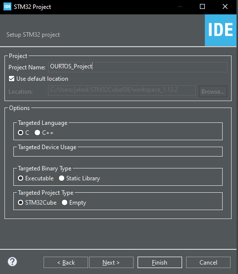
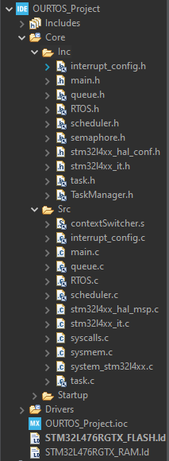
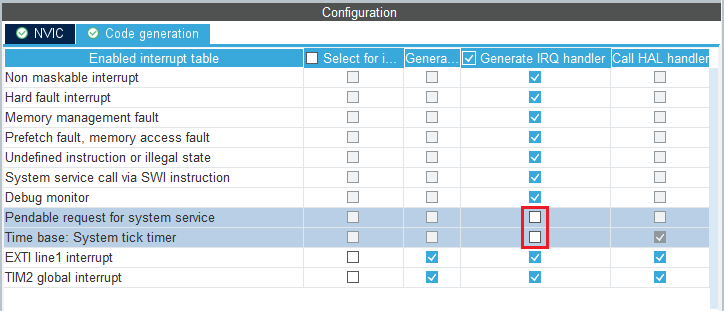

# Getting Started

OURTOS intends to be easy to use, but does still require a little setup

## What you will need:

- An STM32 Nucleo-L476RG Microcontroller
- The STM32CubeIDE
- The Contents of the Repository's `OURTOS` Directory

## Setting Up Your IDE

After STM32CubeIDE is started up and your workspace is set up, create a new project by going to:

File->New->STM32 Project 



Navigate to the Board Selector Tab and select the Nucleo-L476RG.



Ensure Targeted Language is set to `C`, and Targeted Binary Type is set to `Executable`, with Targeted Project Type as `STM32Cube`.



Copy or link the files in /OURTOS/Src/ to the Project's /Core/Src/

Additionally, copy or link the files in /OURTOS/Inc/ to the Project's /Core/Inc/



If the header files are linked to instead of copied, be sure to add their location to the project's include path.

### SysTick_Handler and PendSV_Handler

OURTOS makes use of Custom Definitions for the `SysTick_Handler` and `PendSV_Handler` routines defined in `stm32l4xx_it.c`, so we need to make sure STM32CubeMX doesn't generate them when we regenerate our code.

In the project's *.ioc file, Navigate to the "Pinout & Configuration" tab. Under Categories->System Core->NVIC switch to the `Code Generation` tab, and uncheck the `Generate IRQ handler` checkbox for `Pendable request for system service` and `Time base: System tick timer`.




## Writing Your Code

### Including the Library

To use OURTOS, you must include the main header file in your code:

```C
#include "RTOS.h"
```

### Initializing the Kernel


In the code where you would like to set up the RTOS, you will first need to initialize the Kernel. This can be done with the `OsInitialize` function. The `OsInitialize Function will take 1 parameter for tick-rate, and return initialization status.

An implementation might look like:

```C
if (OsInitialize(1000) != osOK){
    printf("Failure to Initialize!\n");
    for(;;);
}
```

Here, we set the tick-rate to 1kHz, and check for proper initialization. The 1kHz tick rate (defined with 1,000 ticks per second) determines how often the task scheduler will run, as it does so once per tick. Note that a context switch does not always occur eacj time the task scheduler runs (*See [Task Scheduler](./../Task%20Scheduler/Scheduler.md) for more details*). If the `OsInitialize` function doesn't return `osOK`, then we notify the system of the failure. Of course, more elaborate handlers may fit your needs better.

*See [OsInitialize](./../Functions/OsInitialize.md) for more details of how to use the function.*


### Writing The First Task

The OURTOS Standard states that Task functions should take a void pointer as a parameter, and return a void pointer. This is a basic Task function template:

```C
void * TaskFunction(void * args){
    // Task initialization logic goes here
    while (1){
        // Task loop logic here
    }
    return NULL;
}
```

By passing a void pointer as an argument, the `CreateTask` function will be able to take in a pointer of any type according to a TaskFunction's needs, which can then be cast to the correct type from within the Task Funcion for flexible utilization.

The return value will be sent to a location provided by the programmer when they created the task.

### Creating a Task Instance

Before we create a task, we must first create task properties. Task properties contain three members: 

- Priority
- Permissions
- Suspended Status

Priority levels are defined in `RTOS.h`. Note that *`PRIORITY_IDLE`* is reserved for idle tasks.

Permissions are not yet implemented, and should be considered reserved, and should be set to 0 at all times.

Suspended Status will determine if the task is initialized in a suspended state, or if it can run as soon as the kernel is active. `true = suspended`

This can be instantiated as shown:

```C
    TaskProperties properties = {PRIORITY_NORMAL, 0, false};
```

Once a task's function and properties are created, we can finally create an instance of our task. One might do so as shown:

```C
    TaskHandle task1 = CreateTask(TaskFunction, 64, NULL, NULL, properties);
```

Our first argument is where we pass in the function pointer to our task, followed by our task's stack size. Implemented in 4-byte words, the value 64 indicates that we are creating a task with a stack size of 256 bytes available to the Task Function, and all of the functions it may call.

Our third argument is where we would provide a pointer to our arguments that will be passed to our Task Function. Since we aren't passing any arguments to our example, this can be left `NULL`.

At our fourth Argument, we would actually pass a pointer to a pointer. This way, the return value (a void pointer) from our task function (if it ever does reach a `return`), can be stored at a location indicated by our fourth argument. If no return value is used, this can be left `NULL`.

With our final argument, we pass in our task properties. For convenience, multiple calls to `CreateTask` can use the same `TaskProperties` object if desired.

Once a task is created, `CreateTask` returns a `TaskHandle` allowing the programmer to keep track of their tasks, and pass their handles into functions to make changes if desired.

It is always a good practice to ensure that `CreateTask` did not return a `TaskHandle` that was `NULL`, indicating a failure to create the task:

```C
    if (task1 == NULL){
        puts("Failure to create task1");
    }
```

*See [CreateTask](./../Functions/CreateTask.md) for more info on creating tasks.*

### Handing Control to the Kernel

Once all tasks needed before starting are created, we can call `OsStart` to hand control over to the Kernel, which will manage task scheduling and context switching:

```C
if (OsStart() != osOK){
    puts("Failure to Start!");
}
else{
    puts("Successfully Exited RTOS Control");
}
```

`OsStart` can will return a value indicating if the Kernel was successfully started or not. If the Kernel was successfully started, the program should not return to this point until `OsStop` is manually called. If the Kernel was not successfully started, then the program will immediately return an `osError` code.

*See [OsStart and OsStop](./../Functions/OsStart.md) for more info.*

And now you are ready to start exploring the many use-cases of OURTOS!